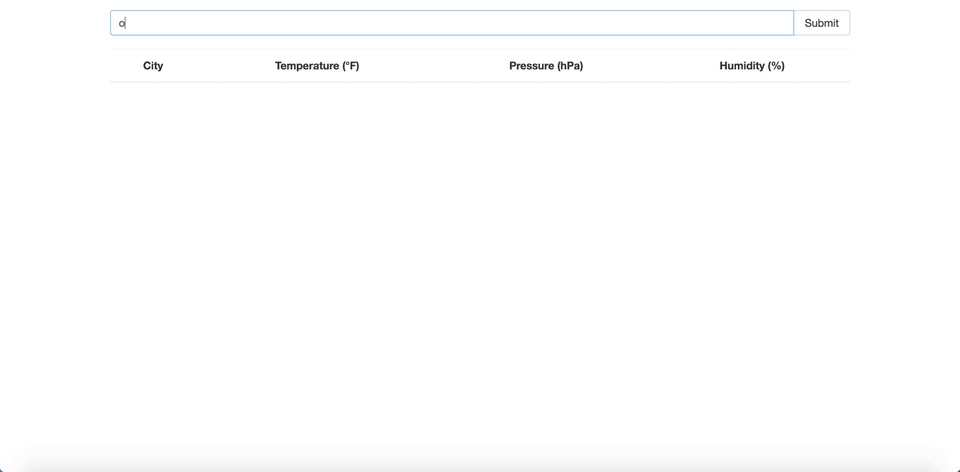
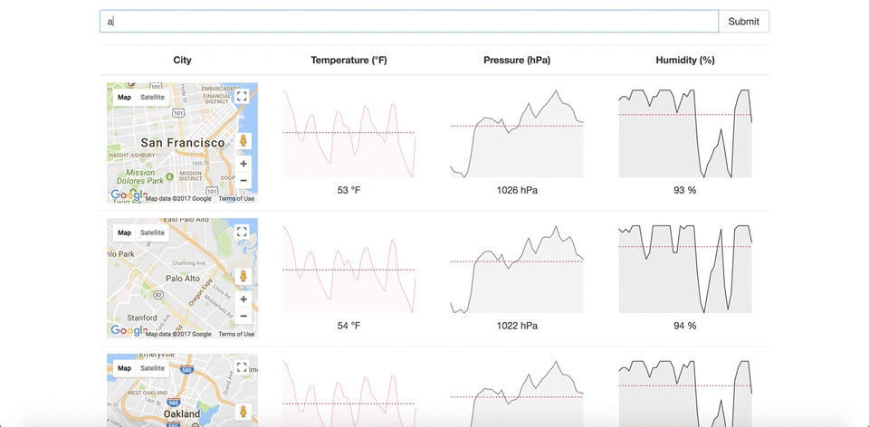

# Forecast5 - A React with Redux Weather App
#### About
A React + Redux App that displays the five-day forecast of every U.S. city.  

#### Usage
<p align="center">
  
  
</p>

#### Setup
Install dependencies, then start the gulp process with the following:

```
> cd Forecast5
> npm install
> npm start
```

#### Learn More
* [OpenWeatherMap API](https://openweathermap.org/)
* [Sparklines](https://www.npmjs.com/package/react-sparklines)
* [Axios](https://www.npmjs.com/package/axios)
* [Google Maps API](https://developers.google.com/maps/documentation/javascript/tutorial)
